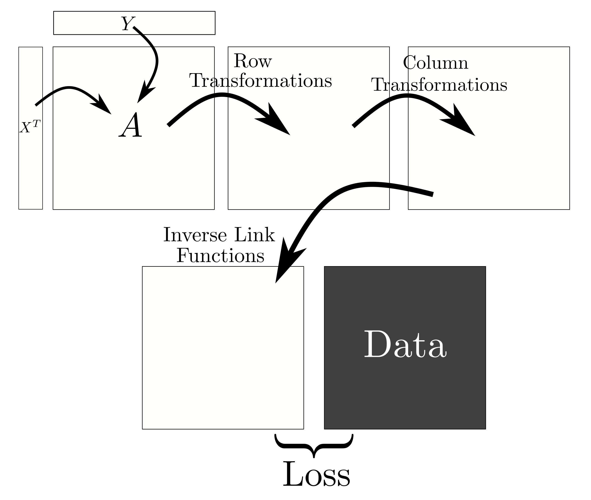

# MatFac.jl

A general-purpose, extensible package for GPU-accelerated matrix factorization modeling.

## Main Ideas

<p align="center">
  
</p>

Suppose you have a big MxN rectangular array of data.
Let the M rows be samples, and N columns be features.

* The columns may contain different _kinds_ of data.
  Some may contain real values; others may contain
  binary, ordinal, or count data.
* The array may have missing (i.e., unobserved) entries.

MatFac.jl allows you to decompose the array into two
_much smaller_ arrays: 

* X: a KxM matrix. Its M columns give a low-dimension embedding of the samples.
* Y: a KxN matrix. Its K rows form an informative basis for our data in N-dimensional space.

Under the simplest conditions, this is equivalent to [principal component analysis](https://en.wikipedia.org/wiki/Principal_component_analysis).
(The rows of Y are the principal components.)

The MatFac.jl API allows you to extend this model much further:
* The user may provide arbitrary (trainable!) _row transformations_ and 
  _column transformations_ that act on the product X^T Y. 
  These can be used to: 
    - "model away" nuisance factors and technical noise; or
    - model a nonlinear map between the latent embedding and your data.
* The user may provide (trainable!) _regularizers_ for the parameters of 
  this model. This includes regularizers for X and Y; the row- and column transformations; and the noise models. 


## Installation and basic usage

To install, do the typical Julia thing:

```
julia> using Pkg; Pkg.install(url="https://github.com/dpmerrell/MatFac.jl")
```

The most important things to know about: 

* `MatFacModel`: The Julia type for the matrix factorization model. 
* `fit!`: The (inplace) function for fitting the model to data.
* `save_model`: Save your model to a BSON file
* `load_model`: Load a saved model from a BSON file

See their docstrings for more details.

Some basic example usage, though:
```julia
using MatFac
using Flux        # for the `gpu` function

# Construct a model for a 1000 x 5000 dataset;
# assume the latent dimension is 10.
my_model = MatFacModel(1000, 5000, 10, loss="poisson";
                       X_reg=x->0.1 .* (x.*x), 
                       Y_reg=y->0.1 .* (y.*y)
                       )

# Load the model and data to GPU
my_model = gpu(my_model)
D = gpu(D)

# Fit the model to data
fit!(my_model, D; lr=0.01, max_epochs=1000)

# Move model back from GPU, and save to a BSON file.
my_model = cpu(my_model)
save_model("fitted_model.bson", my_model)

# We can reload the model later if we wish
reloaded_model = load_model("fitted_model.bson")

# We can access the embedding, factors, etc. from the model
X = reloaded_model.X
```

## Sharp corners

* For now, GPU-acceleration requires that your entire dataset fits on a single GPU.
  This is big enough for, e.g., 10k-by-100k datasets.
  However, we'd eventually like the code to efficiently manage out-of-memory datasets and possibly multi-GPU settings.
* For now, we impose the following order: _row transformations first, column transformations second_.
  This covers a broad swathe of practical settings and keeps the API clean; but in time we'd like to remove this restriction. 
* Right now we only implement `fit!` -- we'd eventually like to provide other parts of the ScikitLearn API for transformers: e.g., `transform`.

## Extending `MatFac.jl` for your application

Row and column transformations can be either (a) functions, 
or (b) callable structs. In either case, they must be differentiable.
Callable structs may contain trainable parameters.

We follow the [Flux.jl](https://fluxml.ai/Flux.jl/stable/) conventions for defining callable structs with trainable parameters:

* Define the type for your struct
* [Use `@functor` to indicate that your struct has trainable parameters](https://fluxml.ai/Flux.jl/stable/models/advanced/)
* Define the `(yourobj::YourType)(...)` function for that type

If Flux.jl's autodifferentiation doesn't work for your transformations, you may find it useful to define custom differentiation rules via [ChainRules and ChainRulesCore.jl](https://juliadiff.org/ChainRulesCore.jl/stable/index.html).


